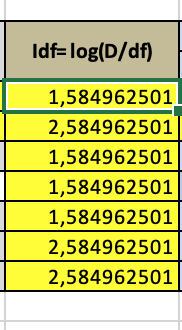
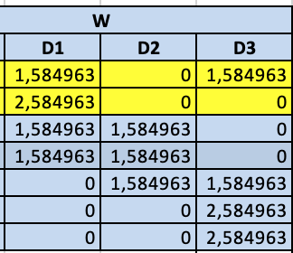
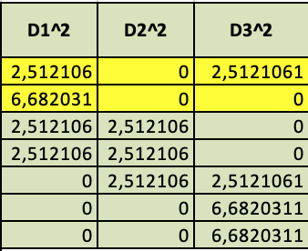

Library for calculate vector space model using cosine similarity..
for now i test this library using indonesian languange. so i didn't testing it with english data. but i was added english lemmatize document. but maybe i will change it to porter algorithm

## How to install
```js
npm install vector-space-model-similarity --save
```

## How to use

first we import our function
```js
import { VSM } from 'vector-space-model-similarity
```

next we define documents, it's an array
```js
const documents = ["rumah saya penuh makanan", "saya suka makan nasi", "nasi berawal dari beras"] // define our variable
```

next we call VSM Class and define our object from VSM class
```js
const document = new VSM(documents); // define our object of VSM
```

```js
const idf = document.getIdfVectorized(); // return an array ob object, the key is tokenize our documents and the value is the 

const query = new VSM(["sistem cerdas"], idf); // we define our object again, it's for query. and we pass our idf constant variable

const cosine = Cosine(query.getPowWeightVectorized()[0], document.getPowWeightVectorized()); // calculating cosine similarity
```
## descriptions
example of vsm calculating using excel.


#### VSM

```js
import { VSM } from 'vector-space-model-similarity
```

VSM is a class that extends from Tfidf class.
VSM has one constructor and in the constructor it has two parameter. the first parameter is an important parameter and the second is optional. it's the parameter
```js
documents: string[], idfVector:any[] = []
```

documents represented about our document, and idfVector is the idf from our vector of IDF number. idfVector is important if you want to search data from query. you must pass idfVector from the idf you got from documents before. to get idfVector use this function.

getIdfVectorized will return this array. but not array of number, it's array of object. the key is the word and the value is the IDF value



```js
getIdfVectorized() // <-- this is method from TFIDF Class.
```

getWeightVectorized() will return idf value. and the return is an multidimension array





```js
getWeightVectorized() // <-- return weight of documents
```

getPowWeightVectorized() will return Exponent of IDF from the documents



```js
getPowWeightVectorized() // <-- return weight of documents
```

<table border="1">
    <tr>
        <th>Methods</th>
        <th>Returned</th>
    </tr>
    <tr>
        <td>getIdfVectorized</td>
        <td>
            any[]
        </td>
    </tr>
    <tr>
        <td>getWeightVectorized</td>
        <td>
            any[][]
        </td>
    </tr>
    <tr>
        <td>getPowWeightVectorized</td>
        <td>
            any[][]
        </td>
    </tr>
</table>


## Cosine
when you was got documents and query vector idf you can use this function

```js
import { Cosine } from 'vector-space-model-similarity
```
Cosine library has two parameters. the first paramter is a query, and the second is a documents

```js
queries:any[], documents:any[][] // <=== the parameters

number[] // <=== the return
```
after you get exponent of document idf from <code>getPowWeightVectorized()</code> you can use this function 

query is single dimension of array, and documents is a multi dimension of array. becasue <code>getPowWeightVectorized()</code> return multidimension array and the query parameter required singledimension of array you must pass the first index of your array. e.g : 

```js

const document = new VSM([
    "sistem cerdas adalah kumpulan elemen",
    "adalah kumpulan elemen yang saling berinteraksi",
    "Sistem berinteraksi untuk mencapai tujuan"
]);

const idf = document.getIdfVectorized();

const query = new VSM(["sistem cerdas"], idf);

const cosine = Cosine(query.getPowWeightVectorized()[0], document.getPowWeightVectorized()); // output : [ 4.457087767265072, 0, 0.4853443577859814 ]

```


## props

### all function you can import from this package
<table border="1">
    <tr>
        <th>Methods</th>
        <th>Returned</th>
        <th>Descriptions</th>
    </tr>
    <tr>
        <td>Tokenize</td>
        <td>
            string[]
        </td>
        <td>To get token from the string. eg : "The sun and the moon" => ["the", "sun", "and", "the", "moon"]</td>
    </tr>
    <tr>
        <td>Stemming</td>
        <td>
            string
        </td>
        <td>currently I'm using lemmatization algorithm. and maybe I will change to porter or other stemming or lemma algorithm. it's a function to get base word. and support english or indonesian. eg : memakan => makan, berlari => lari</td>
    </tr>
    <tr>
        <td>stopword</td>
        <td>
            string[]
        </td>
        <td>to remove not important word. eg : ["saya", "suka", "dia"] => ["suka"]</td>
    </tr>
    <tr>
        <td>stopword</td>
        <td>
            string
        </td>
        <td>to remove not important word. eg : ["saya", "suka", "dia"] => ["suka"]</td>
    </tr>
</table>
